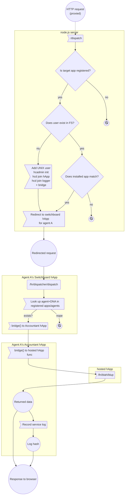

# Holo Prototype hApps: Switchboard & Accountant

The host has several responsibilities:

* Ability to install new hApps that the host wishes to host
* Ability to initialize a new hosted source chain for new users who wish to use a hosted hApp
* Dispatching requests from users to the appropriate installed hApp
* Logging service activity for each hApp

For the prototype, these responsibilities are broken up into two distinct hApps plus one traditional web server:

### Web server

Since holochain-proto apps have no capability to alter the filesystem, a Node.js server is the entry point for all incoming requests. It does things like create new UNIX users and source chains for first-time agents visiting this host.

### holo-host-switchboard

A management and dispatching app. This app is responsible for keeping track of all registered apps. The host identity runs a Switchboard app which the web server queries for app info. Each agent's user also has its own instance of the switchboard app, which the hosted app registers itself with. 

All $U + 1$ (where $U$ is the number of hosted users) instances of the Switchboard app on one host machine share the same DNA, but each host machine will have a different DNA for their Switchboard apps.

### holo-host-accountant

The Accountant app is responsible for recording and reporting on service logs. Requests get routed through the Switchboard, then through the Accountant, and then finally to the hosted hApp.

Each hosted agent has their own Accountant app running, and each Accountant app has its own individual DNA, made unique by the combination of host's identity and hosted agent's identity.

## hApp Topology

Here's a basic illustration of how things hook up. Some notes on the visual representation:

* Solid arrows represent bridges, dotted arrows are http requests
* Circles are hApps. Circles labeled the same have the same DNA, and are allowed to gossip with all other hApps, including on other hosts, with the same DNA.
* The yellow boxes (subgraphs) represent UNIX users. The host itself lives at `/root` and has its own Holochain identity $H$. Each agent has their own UNIX user and Holochain identity.
* Note that the host has both hApps $X$ and $Y$ installed. However, these are not running instances, they are just installed so we know their DNA hash

```mermaid
graph TD
    R("Incoming<br/>Request")
    R -.-> S 
    
    subgraph /root, H, the host
        S>Node.js server]
        AH1(("hApp X"))
        AH2(("hApp Y"))
        D(("Switchboard[H]"))
        D -.- S
    end
    
    D3(("Switchboard[H]"))
    subgraph /agents/C
        S -.-> D3
        D3 --> L3(("Accountant[C,H]"))
        L3 --> A3(("hApp Y"))
    end
    
    D2(("Switchboard[H]"))
    subgraph /agents/B
        S -.-> D2
        D2 --> L2(("Accountant[B,H]"))
        L2 --> A2(("hApp X"))
    end
    
    D1(("Switchboard[H]"))
    subgraph /agents/A
        S -.-> D1
        D1 --> L1(("Accountant[A,H]"))
        L1 --> A1(("hApp X"))
    end
```

A note on notation: The square brackets are used in the sense of type variables, like `List[Int]`. In this case it concretely corresponds to `Property` settings in the DNA. The Accountant hApps always have distinct DNAs across all hosts because they include the host identity and the agent identity directly in its DNA, which pair will always be unique. The Switchboard includes only the host identity so that only Switchboard apps installed on this host can talk to each other.

Note that we've got two instances of app X and one of Y. It doesn't matter how many apps we have registered or what DNAs we're dealing with: Each new agent needs its own instance of whatever app it's for. 

Note also that there will never be one agent with multiple hApps installed on its behalf. Agent X will never have more than one hApp associated with it. *Agents are specific to that app* even if they may correspond to the same user/browser.


### More on the pre-processing http server

The server sitting at top is potentially a temporary shim to handle the filesystem stuff that holochain-proto apps can't. It's possible that holochain-rust will include hooks for this kind of thing. For now, this specifies the behavior that needs to happen.

Current known server vulnerabilities:
* Can be spammed with requests for a valid app hash and a random agent hash, creating spurious app installations on the filesystem that never get used.
* ...

## Request flowchart

Here's a rough flowchart of the path a request will take through these various services. In this chart, each yellow box (subgraph) in this diagram corresponds to a component of the topology diagram above, rather than an agent, thus giving a partial internal view into each service.


